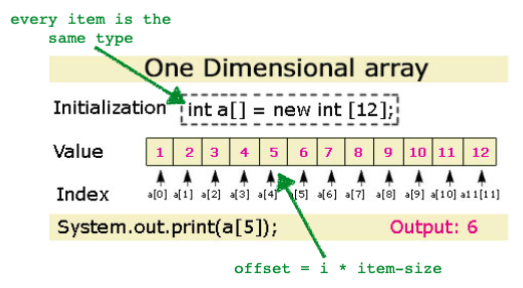
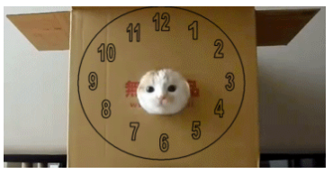

DS&A: "White Boarding", Arrays (vs Objects), Big O
===

## Tooling

For today's work, you need a way to draw pictures and write code. You could either use a code editor and zoom annotate, or consider [InVision freehand](invisionapp.com).

### Setup Break

Let's take 5-10 minutes to get an environment set up!

## Today's Challenges:

person | challenge
---|---
partner 1 | `push`
partner 2 | `pop`
partner 1 | `multiplesOfN`
partner 2 | `unshift`
partner 1 | `shift`
partner 2 | `findIndex`

---

**reshuffle**

---

person | challenge
---|---
partner 1 | `hasDuplicates`
partner 2 | `countLetters`
pair | better `hasDuplicates`

## Arrays "List of Things"

---
### A list of values indexed with integers


---
### In almost every language array items are contiguous in memory...



---
### In JavaScript, Arrays are a special kind of Object 🤔

* But they're still Objects!
* So are Functions! 🤯
    

---
* Available methods promote a concept of order:  
`push()`, `pop()`, `shift()`, `unshift()` 
* Object indices (`cats[2]`) are coerced into strings. 
* `length` is a property
    * Setting indices will automatically lengthen the array
    * **But**, it can be used to truncate the array
* **However** under the covers an array (if used with same data types) has the efficiency of traditional arrays!

Try Me:

```js

// array literal [] notation
a = ['apple', 'pear', 'banana'];

// 📖 read
console.log(a[0]);
console.log(a['0']);

// ✍️ write
a[1] = 'orange';
console.log(a); 
// 📏 auto-extends length:
a[3] = 'cherry';
console.log(a.length);
console.log(a);

// ⛔️ runtime errors: 
// console.log(a.0);
// a.1 = 'orange;

// normal js object stuff: 🛠
a.custom = 'custom property';
console.log(a.custom);

// console.dir shows both the items and property values 🧐
console.dir(a);

// truncate the array 🪚 
a.length = 2;
console.log(a);


```

### Array Operations

To explore how arrays work, we will be doing a series of code challenges.

### Review

Let's see how the built in methods behave:

```js
cats = ['felix', 'garfield', 'duchess'];
cats.push('tom'); // returns new length:
console.log(cats); //  and... adds it at the end of the array:
cats.pop(); // returns last item: 
console.log(cats); // and... removes it from the array:
cats.shift(); // returns first item: 
console.log(cats); // and... removes it from the array:
cats.unshift('hello kitty'); // returns new length:
console.log(cats); // and... adds it at the beginning of the array:


```

### Drawing "boxes"

Demo

### Rules

For these challenges, you can only use the following array operations:

Property | Example
---|---
Read element by index | `const number = arr[i]`
Set element by index | `arr[i] = arr[i + 1]`
Read array length | `for(let i = 0; i < arr.length; i++) {`
Set array length | `arr.length = arr.length - 1`

### Challenge! 

`push` and `pop`!

### Review `for` loops:

```js
let letters = ['a', 'b', 'c', 'd', 'e', 'f', 'g', 'h', 'i', 'j', 'k', 'l', 'm', 'n'];

for(let i = 0; i < letters.length; i++) {
    console.log(letters[i]);
}

for(
    let i = 12; // initializer
    i * i < 500; // continue condition
    i = i - 2 // post loop action
) {
    console.log(i);
}
```

### Challenge! 

`multiplesOfN`

### Challenge!

`shift` and `unshift`

### Finding Values in an Arrays

### Challenge! 

`findIndex`

#### Review: any/all/no logic

> Are there _any_ purple sheep in this flock?


> There are _no_ purple sheep in this flock

1. You must inspect _all_ sheep in the flock looking for a purple sheep. If you find one white sheep, you cannot assume there are _no_ purple sheep
1. However, once you find _any_ (one) purple sheep you can answer the question

> Are there more than one purple sheep?
> Are there two sheep of the same color?

**Does this array contain _any_ duplicates?**

1. Once a single duplicate is found, the search is done (`true`).
1. (Hint: be careful not to compare an element to itself!)
1. Once you have examined _all_ the elements and not found _any_ duplicates, the search is done (`false`)

**HINT:** Using an `else` means you're doing it wrong!

#### Challenge! 

1. **Reminder:** You control start/stop in `for` loops!
1. **Hint:** If the variable `i` is already taken, programmers like to use `j` (next letter in alphabet). 

> `hasDuplicates`

## Objects/Maps/Dictionary - "Key/Value Pairs"

### Domain Modelling

Objects are used for a lot of things in JavaScript, which can make things confusing. For example, objects can be used for domain modelling, that is describing a real-world thing be its attributes:

```js
const cup = {
    material: 'ceramic',
    diameter: 2,
    height: 4,
    color: 'blue',
    hasHandle: true
};
```

### Using keys as indexes

Objects can also be used to track things by key (the property):

```js
const animals = {
    cats: 4,
    dogs: 2,
    birds: 4,
    lizards: 1,
    bears: 0
};
```

This is a powerful computer science concept (actually just how the universe works). Here are some names we give the data structures that uses key/value pairs in this way:

* Map
* Dictionary
* Look-up
* Hash
* Symbol Table

We'll dive into the mechanics of how this works in Week 3

### Object "Refinement" Operations

Get and Set properties using square brace (`[` and `]`) notation.

Since arrays are objects, we've already seen how to set a property:

type | array | object
---|---|---
static (literal) | `array[2] = 42;` | `object['name'] = 'felix';`
dynamic | `let i = 2;`<br>`array[i] = 42;` | `let property = 'name';`<br>`object[property] = 'felix';`
shorthand static "dot" notation | n/a | `object.name = 'felix';`

Here's how we get those properties:

type | array | object
---|---|---
static (literal) | `if(array[2] > 5)` | `if(object['name'] === 'felix')`
dynamic | `let i = 2;`<br>`if(array[i] > 5)` | `let property = 'name';`<br>`if(object[property] === 'felix')`
shorthand static "dot" notation | n/a | `if(object.name === 'felix')`

### Testing if a property exists or has a value:

You can test if a property exists using the built-in `hasOwnProperty`:

```js
const dict = {};
const animal = 'cat';
if(dict.hasOwnProperty(animal)) {
    // already have this property
}
else {
    // need to add the property
}
```

Practically though, you can often test truthy/false, as long as you are not using 0 as a value:


```js
const dict = {};
const animal = 'cat';
if(dict[animal]) { // reads the value of key 'cat'
    // already have this property
}
else {
    // need to add the property
}
```

### Challenge!

`countLetters`

## Big O

Algorithmic Analysis is determining the resources required for a piece of code to run:

* **Time Complexity** - execution time as a function of the input size



* **Space Complexity** - memory/disk space used, as a function of the input size
* **Big O Notation** - the vocabulary we use to discuss complexity

[Big O Cheat Sheet](http://bigocheatsheet.com/)

* O(1): Input size is irrelevant


* O(n): Linear (list iterations) - Complexity grows proportionately to the input size


* O(n^2): Quadratic (nested loops on the same collection) - Complexity grows proportionately to the input size multiplied by itself


* O(log n): divide and conquer (inverse of exponent/quadratic)
* O(n * log n): iterations that use divide and conquer
* O(2^n): Doubles with each input (fibonacci)

### Challenge!

better `hasDuplicates`

## Demo

Real-world `O(n^2)` vs `O(n*logn)`!